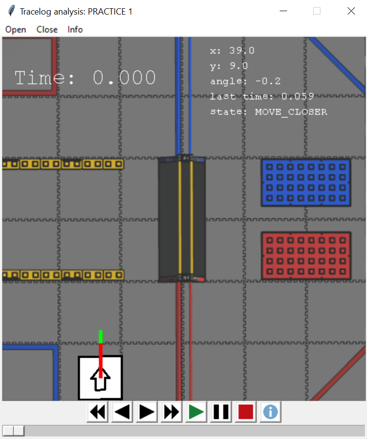

# TRC Trace Log Analyzer

## A timeline-based analysis tool for autonomous trace logs generated by the TRC library

---

---

## Installation

This script depends on `numpy`, `pygame`, and `xmltodict` to run. You can install both by running `python3 -m pip install -r requirements.txt` (`py -m pip install -r requirements.txt` if using Windows) in this directory.

## Versions

It is recommended to use the latest version of Python to run this tool, although it will likely work with versions not far behind. It will not work with Python 2.

As far as I'm aware, this should work fine on macOS and Linux as well as Windows, although I only really tested it on Windows.

## Running

To open a log file you can open `log_analyzer.pyw` by double clicking it or running `python3 log_analyzer.pyw` (`py` instead of `python3` if using Windows). Then, click the `Open` button on the top menu bar of the window and select the .log file you want to open.

You can also run the file with the log file path supplied as an argument (e.g. `python3 log_analyzer.pyw ~/tracelogs/something.log`) or by dragging the file directly onto the script in the file explorer. Both of these methods will directly open up to the specified file.

## Controls

The button controls (left to right) are as follows:

* Jump back - Jumps to the beginning of the log.
* Step back - Moves one position entry back in the log.
* Step forward - Moves one position entry forward in the log.
* Jump forward - Jumps to the end of the log.
* Play - What you would expect.
* Pause - Also what you would expect.
* Stop - Pauses and jumps to the beginning of the log.
* Info - Toggles extra target info vectors (red line is from current pos to target pos, green line represents the target heading).

The `Open` button at the top of the window can be used to open a new log file, and the `Close` button closes the window. The `Info` button displays a dropdown list of menus that can be opened to get more in depth info, including a raw log menu that allows you to click on different lines of the log and be taken to that place in the timeline. It also contains a "Zebra MotionWorks" button, which can be used to pull position data from TheBlueAlliance so where the robot thinks it is and where it actually is can be compared. Note that this does require internet connection.

The timeline at the bottom can be scrolled left and right and moves with the stopwatch timer.

## The config.json file

`config.json` holds information on how the data should be displayed. The `game` key is associated with the name of the game that you want to use. This name should match up with one of the other entries in the top level of the json file, which essentially act as presets for the different games, holding unique info for each. The options are as follows:

* `field_dimensions` - A list containing the x/y dimensions of the field, in inches.
* `screen_dimensions` - A list containing the x/y dimensions of the pygame window, in pixels.
* `blue_origin` - A list containing the field coordinates of the origin for the blue alliance, in inches and based on the bottom left corner as (0, 0).
* `blue_x_direction` - An integer specifying the way in which the x-axis points on the blue alliance.
* `red_origin` - A list containing the field coordinates of the origin for the blue alliance, in inches and based on the bottom left corner as (0, 0).
* `red_x_direction` - An integer specifying the way in which the x-axis points on the blue alliance.
* `field_image` - A string containing the relative or absolute path pointing towards the field background image to use.

The x-direction values should be from 0 to 3 (inclusive), with 0 representing directly pointed to the right and perfectly horizontal, 1 being straight up, 2 being to the left, and 3 being straight down. This assumes that the y-axis is perpendicular 90 degrees counterclockwise from the x-axis.

## Anatomy of a log

Every line that contains data should be in standard XML format, or it will be ignored. The content of the lines should be as follows (all values within quotes, positions in `%.1f` format, and times in `%.3f`):

* At least one Info tag with the name MatchInfo, containing the date, type, and number of a match.
* At least one Info tag with the name AutoChoices, with any autonomous choices selected. This is automatically sorted through.
* Any number of Event tags with the name StateInfo, each containing the time, the current state name, and the current x/y/heading as well as the targets, followed by...
* Any number of Event tags with the name RobotPose, each containing the time and a pose in the format `"(x=%.1f,y=%.1f,angle=%.1f)"` (spaces can also be inserted for readability in logical locations).

Note that the Info tags can be located anywhere in the file and they will still be interpreted correctly. However, with the Event tags, there must be at least one StateInfo already in the log before any RobotPoses are added or the parser won't work.

There is an example log in the top directory for more reference.
